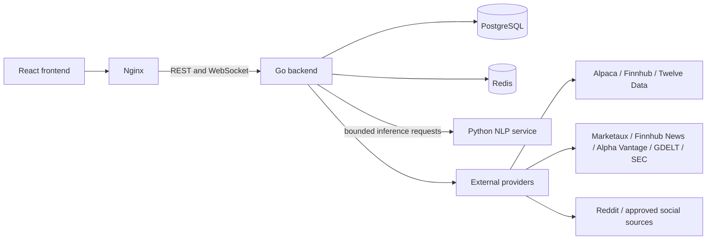
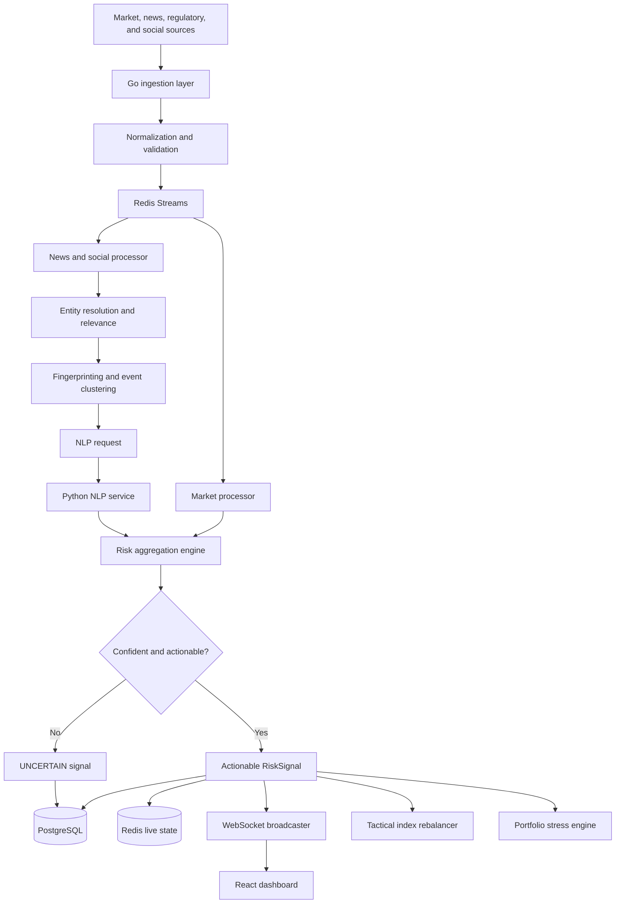

# System architecture

This document defines the target architecture for Trading Wens. It is a design contract, not a statement that every component described here is already implemented.

## Architectural principles

- `RiskSignal` is the central domain object. Raw sentiment and event predictions are evidence used to construct a signal; they are not portfolio actions by themselves.
- PostgreSQL owns durable records. Redis owns short-lived live state, queues, coordination data, and bounded replay buffers.
- Provider payloads are normalized at the ingestion boundary and never leak into domain or frontend contracts.
- Low-confidence NLP output becomes `UNCERTAIN`. It does not trigger rebalancing or stress testing.
- Repeated coverage of one event is clustered. Duplicate articles do not multiply impact; independent coverage contributes to a separate momentum feature.
- The React frontend and Go backend are independent workspace and deployment boundaries. Shared contracts are documented and versioned.
- Simulated market fixtures remain in the shared frontend market module and are always identified as simulated data.
- Authenticated frontend pages remain under the Cloud-managed pathless `_authenticated` gate. User profiles are created on the first authenticated session without modifying the managed auth schema.

## Runtime topology

Only the following services are required at runtime:

- React frontend
- Nginx reverse proxy
- Go backend
- PostgreSQL
- Redis
- Python NLP inference service
- Configured external market, news, regulatory, and social APIs

Training notebooks, datasets, model evaluation utilities, and infrastructure source files are development or deployment inputs, not runtime services.

## End-to-end data flow

## Component responsibilities

### Go ingestion layer

The ingestion layer owns provider connections, HTTP polling, WebSocket market feeds, provider-specific authentication, rate limiting, retry with jittered backoff, health checks, and failover. A provider manager selects the primary and fallback provider per symbol and data type.

Provider adapters emit provider-neutral inputs. Invalid timestamps, malformed symbols, stale observations, impossible prices, and unsupported content are rejected before entering the processing streams.

### Normalization and validation

Market data is normalized into `MarketTick`. News is normalized into `Article`, and social data into `SocialPost`. Each normalized record retains its provider, provider record ID, source timestamps, ingestion timestamp, and trace ID.

Entity resolution maps company names, tickers, and maintained aliases to a canonical company ID. Content below the relevance threshold is stored for audit when appropriate but does not proceed to inference.

### Redis Streams and live state

Redis Streams decouple ingestion from processors and provide consumer-group recovery. The intended streams are:

- `market.raw`
- `news.raw`
- `social.raw`
- `news.cleaned`
- `nlp.requests`
- `nlp.results`
- `risk.signals`
- `rebalance.events`
- `stress.events`

Stream entries must carry an idempotency key and trace ID. Consumers acknowledge an entry only after its required side effects succeed. Pending entries are reclaimed after a bounded idle period. Poison entries move to a dead-letter stream after the configured retry limit.

Redis also holds current prices, current risks, recent fingerprints, cluster working state, provider health, rate-limit counters, WebSocket subscription state, and short-lived idempotency markers. Redis is not the system of record.

### Market processor

Market ticks are written to Redis immediately so the live API and WebSocket layer can serve the latest state. A bounded database writer buffers ticks and uses batch inserts into PostgreSQL for historical analysis.

The processor continuously derives returns, volume changes, realized volatility, price movement, and market reaction features. Derived features are timestamped and linked to the source market interval used for their calculation.

### News and social processor

The content processor cleans text, resolves entities, scores relevance, fingerprints articles, detects exact duplicates, groups semantically similar coverage into event clusters, calculates novelty, and publishes eligible requests for NLP inference.

Exact duplicates are idempotent. Similar articles about the same company in a configured time window update one event cluster. Independent source and author counts become `news_momentum` or `social_momentum`; they do not create repeated full-impact signals.

### Python NLP service

The Python service loads trained models once at startup and exposes bounded batch inference for:

- sentiment score and confidence
- event class and confidence
- base impact estimate and model metadata

Every response includes the model name and version. The Go backend applies confidence policy and combines model output with contextual and market features.

### Risk aggregation engine

The risk engine combines sentiment, event severity, relevance, novelty, source reliability, independent mention momentum, price reaction, volatility change, and volume change. It produces a versioned `RiskSignal` with an impact score from `1.0` to `10.0` and a risk level of `LOW`, `MODERATE`, `HIGH`, `SEVERE`, or `CRITICAL`.

Confidence gating happens before downstream activation. An `UNCERTAIN` result is durable and observable but cannot trigger the portfolio engines.

### Tactical index rebalancer

The rebalancer consumes only actionable signals. It checks impact, confidence, cluster identity, cooldowns, current weight, maximum change per event, per-stock bounds, and portfolio exposure limits. It normalizes the resulting weights to 100%, records the rationale and before/after weights, and publishes the accepted rebalance event.

### Portfolio stress engine

The stress engine maps an actionable event and impact to versioned equity, interest-rate, foreign-exchange, credit, or volatility shocks. It revalues a synthetic or user-owned portfolio, stores position- and portfolio-level results, and publishes a summary to subscribed clients.

### API and WebSocket layer

The REST API provides versioned snapshots, historical queries, portfolio operations, and stress-test requests. WebSockets deliver live prices, risk signals, provider health, rebalance events, and stress results only for a client's authorized subscriptions.

Slow WebSocket clients have bounded outbound queues. The server coalesces replaceable updates such as prices and disconnects clients that remain unable to consume data; it does not allow unbounded goroutine or memory growth.

## Workspace boundaries

The target repository layout is described in [repository-layout.md](repository-layout.md). The important boundary is that `frontend/` and `backend/` remain independently buildable. Frontend TypeScript types and backend Go types must be generated from or checked against a documented versioned API contract rather than copied manually.

## Operational guarantees

- At-least-once stream delivery is made safe with idempotent consumers and database uniqueness constraints.
- Market history is persisted in batches; live market state is updated immediately.
- Every signal is traceable to its source content, event cluster, model version, market feature window, and aggregation policy version.
- Provider, NLP, PostgreSQL, and Redis failures are surfaced through health metrics and structured logs without leaking credentials or private content.
- Graceful shutdown stops intake, drains bounded workers, flushes database batches, returns unacknowledged stream work for recovery, and closes client connections within a deadline.

Detailed data ownership and contracts are in [system-design.md](system-design.md). Runtime paths and recovery behavior are in [workflows.md](workflows.md).
