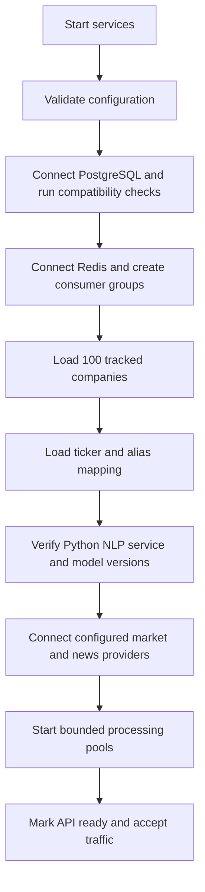
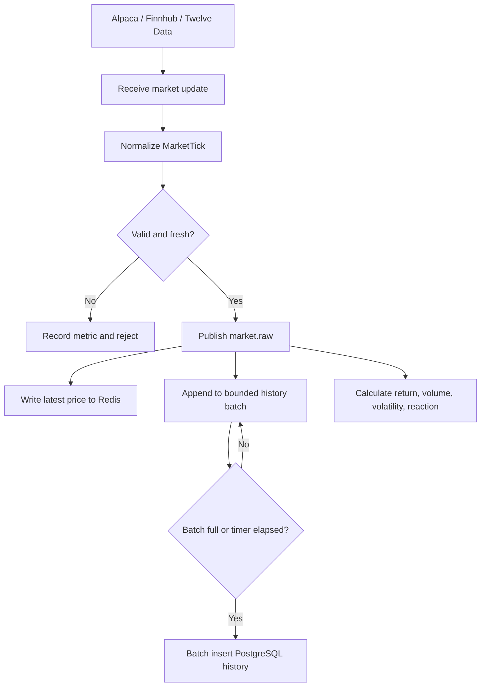
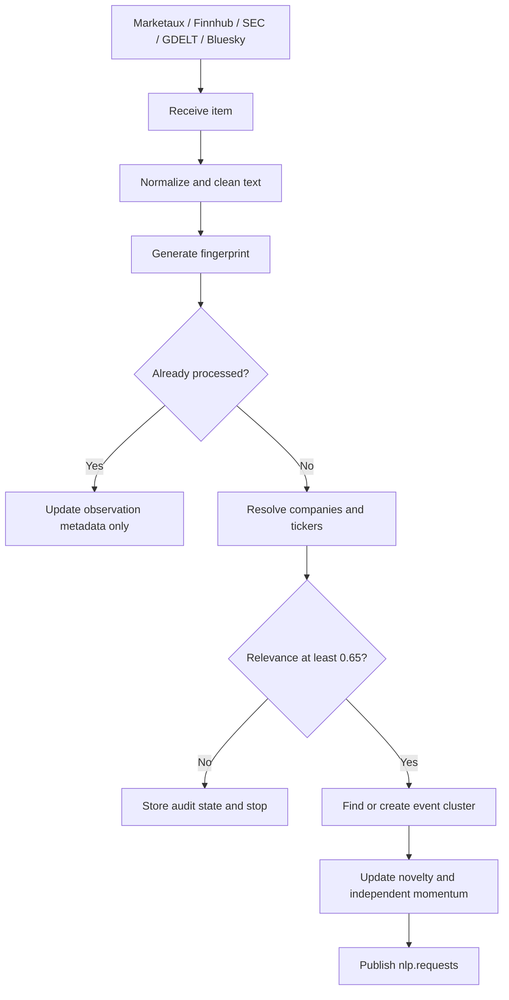
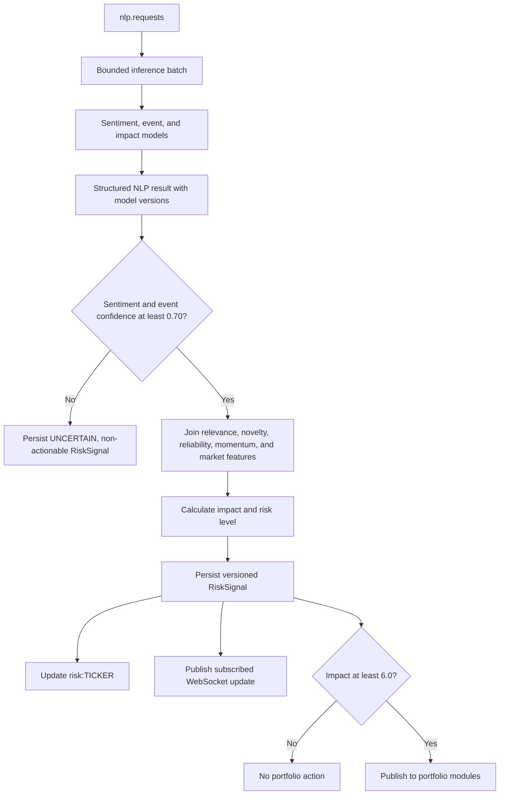
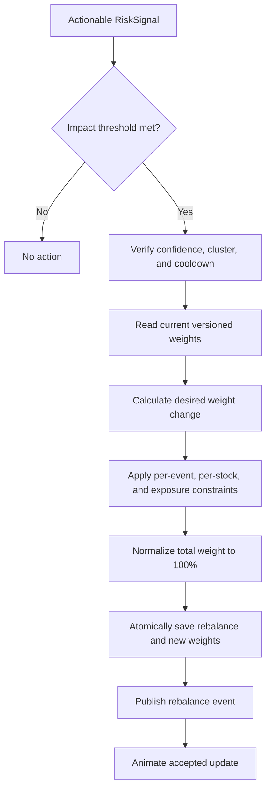
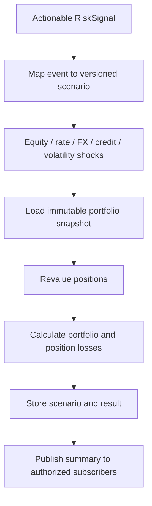
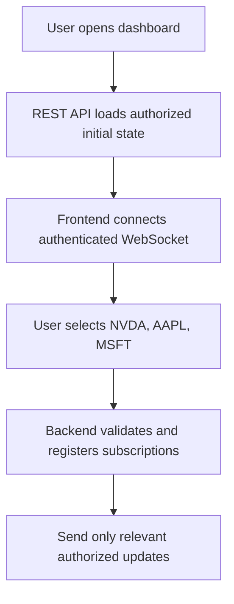

# Runtime workflows

This document records the intended startup, real-time processing, user, portfolio, and failure-recovery workflows.

## System startup

The Python service loads each configured model once during its own startup. The Go backend does not report readiness until required configuration is valid and required dependencies are compatible. Optional provider failure may put the service in a documented degraded mode; it must not be mistaken for full readiness.

## Real-time market pipeline

Redis receives current market state immediately. PostgreSQL receives historical ticks or bars in batches instead of one insert per tick. The batch writer flushes on both size and time thresholds so low-volume symbols are not held indefinitely.

## News and social pipeline

For example, "Nvidia faces additional US AI-chip restrictions" resolves to NVIDIA Corporation and `NVDA`. If relevance is `0.99`, the content enters the matching event cluster. Similar coverage during the cluster window updates evidence rather than creating repeated full-impact events.

## NLP and risk pipeline

An illustrative confident result could contain sentiment `-0.89` with confidence `0.94`, event `GEOPOLITICAL` with confidence `0.93`, and base impact `8.2`. After contextual aggregation it might produce impact `9.1` and `CRITICAL`. These numbers are illustrative, not live data or fixed model behavior.

## Tactical index rebalancing

For illustration, an `NVDA` weight of 10.0% might move to 8.5% after a high-impact negative event. The actual change is determined by versioned policy and constraints. One event cluster cannot repeatedly reduce the holding beyond its cumulative cap.

## Paper-order monitoring

The authenticated order monitor reads the configured Alpaca paper account only. After provider normalization, the backend persists the snapshot under the authenticated Google user and provider account before returning it. The Overview exposes four distinct views:

- **Positions** uses a hierarchical account/contract grid with quantity, average price, current mark, market value, signed daily change, and signed unrealized P/L.
- **Working Order Book** shows submitted and executed quantities, price, current status, cancellation in the full monitor, and the stored model sentiment, direction, confidence, possibility, reason, and sources.
- **Fill Book** shows execution time, quantity, fill price, the current open-position mark when available, and the signed mark delta. Mark delta is contextual information, not realized profit or loss.
- **Audit Trail** orders submission, status, cancellation, rejection, expiration, and execution messages by provider timestamp. Every row identifies whether its source was the Alpaca order API or account-activity API.

Profiles are created during password registration or on the first authenticated Google session. Password hashes are stored separately from profiles, and no managed authentication schema is modified. Position and account snapshots are retained once per minute, current positions are replaced transactionally by the database function, order state is idempotently updated, fills use provider IDs for deduplication, and audit events are append-only.

The position outlook is a bounded directional scenario derived from current Alpaca unrealized P/L, today's mark movement, and confidence-weighted sentiment for matching Alpaca/GDELT headlines. It reports its score, confidence, reasons, and evidence sources. It is not presented as a guaranteed probability, exchange risk calculation, or investment recommendation.

## Portfolio stress testing

An illustrative geopolitical scenario may apply a `-10%` equity shock, `+2%` interest-rate shock, and `-5%` foreign-exchange shock. A $10,000,000 portfolio revalued to $8,900,000 has an illustrative loss of $1,100,000. Scenario parameters are versioned and must not be inferred from this example at runtime.

## User workflow

The dashboard can continuously show live prices, sentiment evidence, confidence, risk level, impact, event type, new cluster evidence, market movement, index weights, provider health, and stress results. Simulated values remain visibly labeled and never appear as live provider output.

## Failure and recovery workflows

### Market provider failure

1. Provider health checks detect stale or failed data.
2. The provider manager opens a circuit and marks affected symbols degraded.
3. Symbols switch to the configured fallback, such as Alpaca to Finnhub.
4. Clients receive provider-health state so fallback data is not misrepresented.
5. The primary provider is probed and restored only after the recovery policy succeeds.

### Python NLP service failure

1. The Go client stops sending new calls after the circuit-breaker threshold.
2. `nlp.requests` remain pending in Redis Streams.
3. No forced classification is produced from missing inference.
4. The Python service restarts and reloads its declared model versions.
5. Pending entries are reclaimed and processed idempotently.

### PostgreSQL failure

1. Redis live prices and bounded live processing continue in degraded mode.
2. Database writers retain recoverable work in streams and retry with backoff.
3. Durable mutations that cannot be safely acknowledged return an error rather than claiming success.
4. When PostgreSQL recovers, idempotent batch writers catch up.
5. Readiness and lag metrics remain degraded until the backlog is within limits.

### Redis failure

1. The service reports not ready because live state and streams are unavailable.
2. PostgreSQL history remains intact.
3. Provider intake is paused or bounded locally according to the configured safety limit.
4. After Redis recovers, live snapshots are rebuilt from current providers and durable state.
5. Stream consumers resume from persisted stream and consumer-group state where available.

### Slow WebSocket client

1. Updates enter the client's bounded outbound queue.
2. Replaceable price updates are coalesced by symbol.
3. Non-replaceable event delivery observes a strict queue and time limit.
4. A persistently slow client is disconnected with a retryable reason.
5. The client reconnects, reloads a REST snapshot, and resubscribes.

## Graceful shutdown

Shutdown first marks the service unready, then stops provider intake, stops claiming new stream entries, drains workers within a deadline, flushes market-history batches, acknowledges only completed work, closes WebSockets, and terminates. Unfinished stream entries remain recoverable by another consumer.
